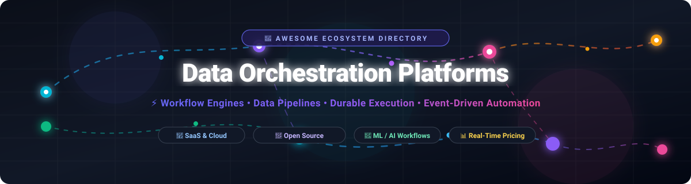
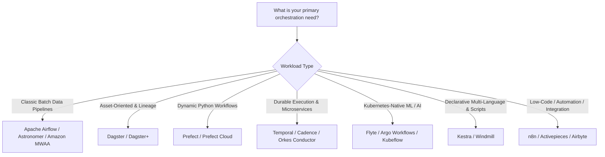

# 🚀 Awesome Data Orchestration Platforms

### A Curated Directory of SaaS Products & Open-Source Workflow Engines

  
  
  
  
  
  

  <em>A comprehensive, search-optimized guide to modern workflow orchestration engines, data pipeline frameworks, durable execution engines, asset-oriented schedulers, and ML/AI workflow automation platforms.</em>

  <b>🕒 Last updated: August 2026</b>

---

## 📌 Overview & Ecosystem Summary

**Data orchestration platforms** are the backbone of modern data engineering and distributed computing. They schedule, coordinate, monitor, and manage complex workflows, handling dependency graphs (DAGs), automatic retries, observability, alerting, backfilling, and dynamic scaling across batch, streaming, microservice, and machine learning architectures.

Whether you need a **fully managed cloud SaaS orchestrator** with enterprise governance or a **self-hosted open-source framework** with high flexibility, this repository curates the leading solutions with real-time pricing breakdowns, company valuations, free tier limits, and GitHub community metrics.

### 🔍 Key Capabilities Evaluated
- ⚙️ **Workflow Paradigms**: Code-as-Configuration (Python DAGs), Declarative YAML/JSON, UI-driven / Low-Code, Software-Defined Assets (SDA).
- 🔄 **Execution Styles**: Batch Pipelines, Event-Driven Streaming, Microservice Orchestration, Long-Running Durable Execution, Kubernetes-Native Jobs.
- 💰 **Commercial Transparency**: Starting tier prices, free forever limits, free trials, and company scale.

---

## 📑 Table of Contents

- [🏢 SaaS & Managed Platforms](#-saas--managed-platforms)
- [🌟 Open-Source GitHub Projects](#-open-source-github-projects)
- [🎯 Choosing the Right Orchestrator](#-choosing-the-right-orchestrator)
- [🏷️ SEO Keywords & Topics](#️-seo-keywords--topics)
- [🤝 How to Contribute](#-how-to-contribute)
- [📈 Star History](#-star-history)
- [📄 Disclaimer](#-disclaimer)

---

## 🏢 SaaS & Managed Platforms

The table below lists the top commercial data orchestration platforms sorted in descending order by company valuation / revenue scale:

| Platform | Company & Valuation / Scale | Description | Starting Pricing | Free Tier / Trial Limits |
| :--- | :--- | :--- | :--- | :--- |
| **[Amazon MWAA](https://aws.amazon.com/mwaa/)** | **Amazon (AWS)** `~$2.0T+` Market Cap `~$600B+` Annual Rev | Fully managed Apache Airflow service on AWS for running data pipelines securely without managing cluster infrastructure. | Starts at **$0.49/hour** (~$353/month for US East) for Small environment + $0.055/hour per additional worker/scheduler + $0.10/GB-month metadata storage. | **No AWS Free Tier** (billed from first hour of environment creation). Free local testing via open-source `aws-mwaa-local-runner`. |
| **[Control-M Cloud (BMC Helix)](https://www.bmc.com/)** | **BMC Software** (KKR / Elliott) `~$6.0B+` Valuation `~$2.0B+` Annual Rev | Enterprise workload automation and hybrid-cloud orchestration platform for mission-critical batch and enterprise scheduling. | **Starter Pack**: Starts at **$2,400/month** (billed annually) for full SaaS orchestration, SLA management, and 24x7 enterprise support. | **30-day free trial (POC)** with full production functionality and pre-configured test workflow environments. No permanent free tier. |
| **[Temporal Cloud](https://temporal.io/)** | **Temporal Technologies** `~$1.5B+` Valuation `$120M+` Raised (Series B) | Fully managed durable execution engine ensuring zero state loss for long-running workflows, microservices, and financial transactions. | **Essentials Plan**: Starts at **$100/month** base (includes 1M Actions, 1 GB Active Storage, 40 GB Retained Storage; $50/M Actions thereafter); **Business**: Starts at **$500/month**. | **Free trial** with **$1,000 in evaluation credits** for new accounts (up to $6,000 credits for qualifying startups). No permanent free tier. |
| **[Astronomer (Astro)](https://www.astronomer.io/)** | **Astronomer, Inc.** `~$1.0B+` Valuation (Unicorn) `$280M+` Raised (Series C) | Enterprise-grade managed Apache Airflow platform featuring multi-cloud deployment, deep lineage, CI/CD automation, and high availability. | Starts at **$0.35/hour** (~$250/month) base for Developer tier deployments + compute resource consumption. | **14-day free trial** with **$20 in platform/compute credits** (no credit card required upfront). No permanent free tier. |
| **[Prefect Cloud](https://www.prefect.io/)** | **Prefect Technologies** `~$250M+` Valuation `$50M+` Raised (Series B) | Hybrid-execution workflow management platform with Pythonic decorators, dynamic subflows, and real-time observability. | **Starter Plan**: **$100/month** (up to 3 users, 20 deployments, 75 hrs serverless compute); **Team Plan**: **$100/user/month** (4–8 users). | **Hobby Plan (Free Forever)**: 2 users, 5 deployments, 500 minutes of serverless compute/month, 7-day run history, and 625 API req/min. |
| **[Dagster+ / Dagster Cloud](https://dagster.io/)** | **Elementl (Dagster Labs)** `~$200M+` Valuation `$50M+` Raised (Series B) | Asset-oriented data orchestrator focused on software-defined assets (SDAs), declarative pipelines, automated data lineage, and CI/CD preview environments. | **Solo Plan**: **$10/month** base fee + $0.04/credit + $0.010/min serverless compute; **Starter Plan**: **$100/month** base fee + $0.035/credit. | **30-day free trial** with full feature access and included trial execution credits. No permanent free tier. |
| **[Orkes Conductor](https://orkes.io/)** | **Orkes, Inc.** `~$100M+` Valuation `$30M+` Raised | Enterprise cloud orchestration platform built by the original creators of Netflix Conductor for resilient microservices and AI agent pipelines. | Enterprise Cloud plans are quote-based via custom contract / AWS Marketplace SaaS listing; Developer Edition is completely free. | **Developer Edition (Free Forever)**: Free hosted sandbox at `developer.orkescloud.com` with no expiration and full Conductor OSS + AI tooling; **14-day trial** for Orkes Cloud. |
| **[Flyte Cloud / Union.ai](https://flyte.org/)** | **Union.ai** `~$60M+` Valuation `$29M+` Raised | Managed Kubernetes-native orchestration engine designed for high-performance ML, AI model training, and data engineering pipelines with strict typing. | **Union Serverless**: Pay-as-you-go starting at **$0.12/CPU Core-hour**, **$0.029/GB-hour memory**, and **$0.71/GPU-hour** (T4); Dedicated Union Cloud from ~$2,500/month. | **Free trial** with **$30 in serverless compute credits** (GitHub login, no credit card required). No permanent free tier. |
| **[Windmill](https://www.windmill.dev/)** | **Windmill Labs** `~$50M+` Valuation `$10M+` Raised (Benchmark / YC) | High-speed workflow engine, background job scheduler, and auto-generated UI builder converting multi-language scripts into production pipelines. | **Team Plan**: Starts at **$20/developer seat/month** ($10/operator seat/month) + compute usage ($0.001/execution overage). | **Community Plan (Free Forever)**: Includes up to 3 workspaces and 1,000 cloud executions/month (or unlimited executions if self-hosted OSS). |
| **[Kestra Cloud](https://kestra.io/)** | **Kestra Technologies** `~$25M+` Valuation `$8M+` Raised | Declarative YAML-based workflow orchestration and automation platform with built-in code editor and 600+ plug-and-play connectors. | Free self-hosted OSS; Managed Cloud/Enterprise tiers require custom sales quote (~**$5–$10/month** on 1-click cloud templates like Railway). | **14 to 30-day trial** available upon demo request; permanent free open-source edition (Apache 2.0) with unlimited workflow executions. |

---

## 🌟 Open-Source GitHub Projects

The following table lists leading open-source orchestration engines, ranked in **descending order by GitHub star count**:

1. **[n8n](https://github.com/n8n-io/n8n)**   
   Fair-code licensed, node-based workflow automation and data orchestration platform connecting 400+ services with native AI agent integration and visual canvas.

2. **[Apache Airflow](https://github.com/apache/airflow)**   
   The industry-standard open-source workflow management platform, using Python DAGs to author, schedule, and monitor complex batch data pipelines at enterprise scale.

3. **[Activepieces](https://github.com/activepieces/activepieces)**   
   Open-source, self-hostable workflow automation and data orchestration engine built for business automation, webhook triggers, and AI agent workflows.

4. **[Prefect](https://github.com/PrefectHQ/prefect)**   
   Modern, Python-native workflow orchestration framework designed for dynamic DAGs, resilient background task execution, retries, and developer ergonomics.

5. **[Temporal](https://github.com/temporalio/temporal)**   
   Microservice orchestration and durable execution engine that guarantees state persistence and fault tolerance across distributed services in multiple SDKs (Go, Java, Python, TypeScript, .NET).

6. **[Airbyte](https://github.com/airbytehq/airbyte)**   
   Leading open-source ELT data integration and sync platform orchestrating extract and load pipelines across 350+ pre-built connectors.

7. **[Kestra](https://github.com/kestra-io/kestra)**   
   Declarative, YAML-based event-driven and scheduled workflow orchestrator featuring an intuitive web UI, embedded code editor, and 600+ integrations.

8. **[Luigi](https://github.com/spotify/luigi)**   
   Pioneering Python package developed by Spotify for building complex pipelines of batch jobs, dependency resolution, target checkpoints, and execution graph visualization.

9. **[Windmill](https://github.com/windmill-labs/windmill)**   
   High-performance developer platform and workflow orchestrator that converts Python, TypeScript, Go, Bash, and SQL scripts into scalable background jobs, flows, and auto-generated internal UIs.

10. **[Argo Workflows](https://github.com/argoproj/argo-workflows)**   
    CNCF graduated, container-native workflow engine implemented as a Kubernetes CRD for parallel compute, ML training, data transformations, and CI/CD pipelines.

11. **[Dagster](https://github.com/dagster-io/dagster)**   
    Modern data orchestrator designed for software-defined assets (SDAs), declarative data management, strong data lineage, end-to-end testing, and developer productivity.

12. **[Netflix Conductor (Community)](https://github.com/conductor-oss/conductor)**   
    Microservice and distributed workflow orchestration platform built originally at Netflix to coordinate stateful execution, event handlers, and tasks at massive cloud scale.

13. **[Kedro](https://github.com/kedro-org/kedro)**   
    Linux Foundation AI & Data project providing a modular Python framework for creating reproducible, maintainable, and deployable data science and ML code pipelines.

14. **[Mage AI](https://github.com/mage-ai/mage-ai)**   
    Hybrid interactive notebook and code-driven data pipeline orchestrator integrating modern data transformation, real-time streaming, and AI pipeline generation.

15. **[Flyte](https://github.com/flyteorg/flyte)**   
    Kubernetes-native, highly scalable workflow orchestrator built by Lyft, offering strongly typed multi-language tasks, caching, and reproducibility for ML and big data workloads.

16. **[Cadence](https://github.com/cadence-workflow/cadence)**   
    Distributed, scalable, durable, and fault-tolerant orchestration engine originally developed at Uber to power long-running asynchronous business logic and background services.

17. **[Apache NiFi](https://github.com/apache/nifi)**   
    Enterprise dataflow automation system featuring real-time streaming, interactive drag-and-drop web canvas, guaranteed delivery, dynamic prioritizing, and complete data provenance.

18. **[Metaflow](https://github.com/Netflix/metaflow)**   
    Human-friendly Python/R framework originally developed at Netflix for constructing and managing real-life data science, deep learning, and ML infrastructure workflows.

---

## 🎯 Choosing the Right Orchestrator

- **Classic Data Warehousing / Batch ETL**: Choose **[Apache Airflow](https://github.com/apache/airflow)** or **[Dagster](https://github.com/dagster-io/dagster)** for proven production stability, mature plugin ecosystems, and rich dependency handling.
- **Dynamic Python & Modern Data Stack**: Choose **[Prefect](https://github.com/PrefectHQ/prefect)** for seamless native Python code execution without heavy DAG boilerplate.
- **Resilient Microservices & Durable Workflows**: Choose **[Temporal](https://github.com/temporalio/temporal)** or **[Orkes Conductor](https://github.com/conductor-oss/conductor)** to guarantee state retention across distributed failures without manual checkpoint code.
- **Machine Learning & Container-First Workflows**: Choose **[Flyte](https://github.com/flyteorg/flyte)** or **[Argo Workflows](https://github.com/argoproj/argo-workflows)** for strict data typing, container caching, and high-scale Kubernetes execution.
- **Polyglot Automation & Internal Tooling**: Choose **[Kestra](https://github.com/kestra-io/kestra)** or **[Windmill](https://github.com/windmill-labs/windmill)** for YAML-based declarative logic, fast script execution (Python/TS/Go/Bash/SQL), and UI generation.

---

## 🏷️ SEO Keywords & Topics

`data-orchestration` • `workflow-engine` • `data-engineering` • `data-pipelines` • `durable-execution` • `dag-orchestrator` • `apache-airflow` • `prefect` • `dagster` • `temporal` • `flyte` • `kestra` • `windmill` • `argo-workflows` • `etl-pipeline` • `machine-learning-pipelines` • `cloud-orchestration` • `open-source`

---

## 🤝 How to Contribute

We welcome community contributions! To add a new platform or update existing metrics:

1. 🍴 **Fork the repository**.
2. 📝 **Add or edit entries in [README.md](file:///C:/Users/ishan/Documents/Projects/Awesome-Data-Orchestration-Platform/README.md)**:
   - For **SaaS platforms**, provide official pricing, free trial limits, valuation/funding data, and website links.
   - For **Open-Source projects**, add the official repository, star badge, and an accurate 1-2 sentence description.
3. 🔀 **Submit a Pull Request** with a clear explanation of changes.

⭐ **Star this repository** if you find it helpful for your data engineering and orchestration stack!

---

## 📈 Star History

---

## 📄 Disclaimer

- This is a **community-curated index** for informational and educational purposes.
- Valuations, funding figures, and pricing tiers reflect publicly available figures as of **August 2026** and are subject to vendor updates.
- Orchestration systems are mission-critical infrastructure. Always configure high availability, idempotent task design, secrets management, and robust monitoring (OpenTelemetry, Prometheus) before deploying to production.

---

  Built with ❤️ for data engineers, platform architects, and ML engineers building resilient automated systems.

